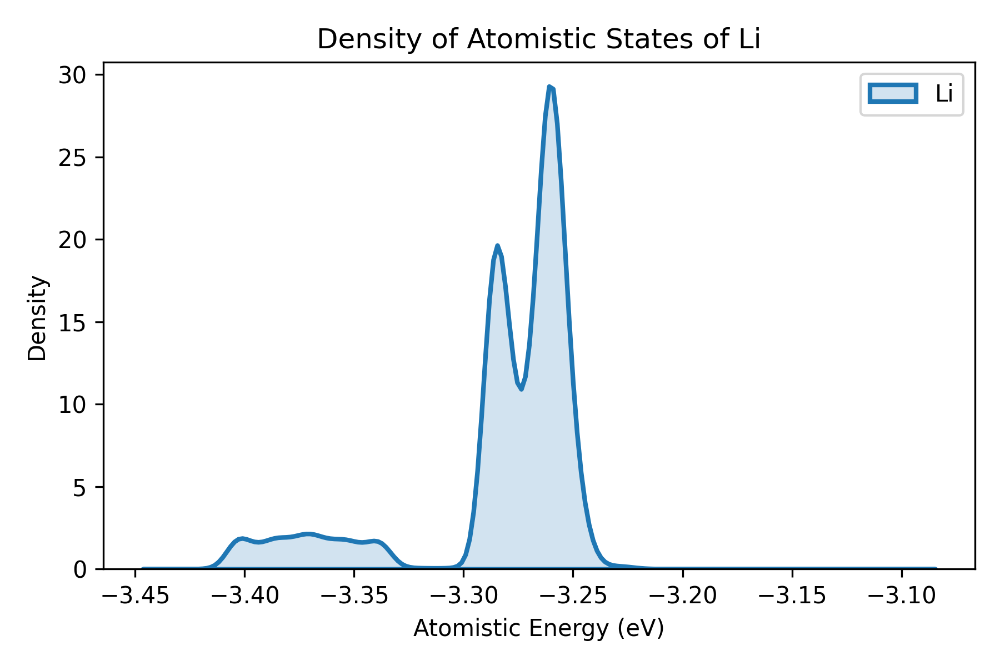
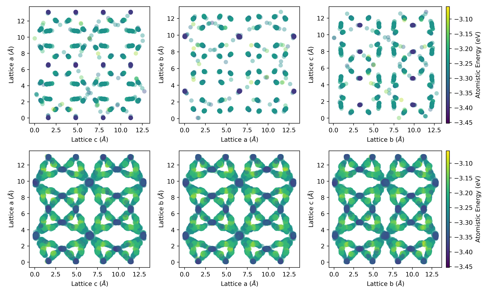

# DOAS and AEDP

In Machine Learning Interatomic Potentials (MLIPs) such as the Neuroevolution Potential (NEP), the total potential energy of a system is formulated as the sum of individual atomistic energies. Each atomistic energy is uniquely determined by its local atomic environment.

This principle allows us to extract the **Density of Atomistic States (DOAS)**, a method first proposed by Wang et al. to successfully reveal energy frustration and structural heterogeneity in superionic conductors [[1]](https://doi.org/10.1002/anie.202215544). By constructing a histogram of the atomistic energies of mobile ions (e.g., Li+), DOAS provides direct insight into the distribution of local environments and the overall energy landscape. 

Taking this one step further, we can map each site energy to its spatial coordinates to produce an **Atomistic Energy Distribution Plot (AEDP)** — a 2D projection map that uses site energy as a color scale, making it straightforward to visually identify high-energy and low-energy sites.

In this tutorial, we will use the solid electrolyte LLZO (Li<sub>7</sub>La<sub>3</sub>Zr<sub>2</sub>O<sub>12</sub>) as an example to demonstrate how to perform DOAS and AEDP analyses using **GPUMD**. 

### Step 1: MD Simulation Setup

LLZO undergoes a structural phase transition from a low-ionic-conductivity **tetragonal phase** to a high-ionic-conductivity **cubic phase** at approximately 900 K. To capture how the energy landscape evolves across this transition, we compare two conditions:

- **600 K:** tetragonal phase (low conductivity)
- **1000 K:** cubic phase (high conductivity)

> For the scientific background and extended methodology, see our GPUMDkit paper [[2\]](https://arxiv.org/abs/2603.17367).

We use the LLZO NEP model trained in that work, which employs a relatively large cutoff radius of **7.5 Å**. This makes the model highly sensitive to the local atomic environment, enabling a more accurate description of site-energy distributions.

The simulation protocol consists of two stages:

1. **Pre-equilibration**: a 100 ps MD run to equilibrate the system.
2. **Production run**: a 500 ps run that outputs 500 trajectory frames.

The `run.in` script for the 600 K simulation is shown below:

```
potential ./nep.txt
velocity    600

ensemble    nvt_nhc 600 600 100
run        100000

ensemble    nvt_nhc 600 600 100
dump_thermo 100
dump_exyz  1000
run        500000
```

### Step 2: Extracting Frames using GPUMDkit

To keep the downstream analysis computationally tractable, we uniformly sample **100 frames** from the 500-frame `dump.xyz` trajectory using GPUMDkit:

1. Run `gpumdkit.sh` in your terminal.
2. Select function **201** — *Sample structures from extxyz*.
3. When prompted, enter: `dump.xyz uniform 100`

GPUMDkit will uniformly sample 100 frames and save them to `sampled_structures.xyz`.

> **Note:** Alternatively, you could configure `dump_exyz` in your MD run to write only 100 frames directly. The approach here is simply intended to showcase GPUMDkit's post-processing capabilities.

### Step 3: Energy Minimization

The sampled frames contain thermal vibrations that would obscure the underlying site-energy distribution. We therefore **energy-minimize** each frame before analysis. GPUMDkit automates this batch process:

1. Run `gpumdkit.sh` and select function **302** — *MD sample batch pretreatment*.
2. The script will automatically create a separate simulation folder for each of the 100 frames.
3. Place your minimization `run.in` and `nep.txt` into the generated `md/` directory.
4. Submit the batch jobs to run GPUMD in each folder.

The minimization `run.in` should look like this:

```
potential ./nep.txt

minimize sd 1.0e-6 10000

ensemble    nve
time_step   0
dump_xyz    -1 0 1 relaxed.xyz potential
run         1
```

> Here, `minimize sd` performs steepest-descent minimization. The subsequent `run 1` step with `time_step 0` is a zero-time-step trick to trigger the final `dump_xyz` output, writing the relaxed structure together with per-atom potential energies into `relaxed.xyz`.

### Step 4: Post-processing the Relaxed Structures

Once all minimization jobs have finished, each folder will contain a `relaxed.xyz` file with the relaxed atomic positions and their corresponding site energies.

**Concatenate all relaxed frames into a single file:**

```bash
cat sample_*/relaxed.xyz >> all_relaxed.xyz
```

**Extract the Li site energies:**

```bash
grep Li all_relaxed.xyz | awk '{print $5}' > doas_600K.out
```

> The site energy is stored in the 5th column of each atom line in the `.xyz` file, which is the determined by your `dump_xyz` command. Adjust the column index if your format differs.

### Step 5: Plotting the DOAS

GPUMDkit provides a convenient one-liner for DOAS plotting. It requires the input file to carry a header line specifying the element symbol in the following format:

```
# Li
-3.21758677
-3.25450489
-3.25118673
...
```

Add the header to your file, then generate the plot with:

```bash
gpumdkit.sh -plt doas doas_600K.out Li
```

You will see:

<div align="center">
    
</div>

In tetragonal LLZO, the Li-ion energy distribution displays three distinct, sharp peaks corresponding to three kinds of fully occupied crystallographic sites: the tetrahedral 8a position and two octahedral positions 16f and 32g. These peaks reflect the ordered Li-ion sublattice in the tetragonal LLZO. See our GPUMDkit paper for more details.

### Step 6: Generating the AEDP

For the AEDP, you need both the **position** and the **atomistic energy** of each Li atom. Extract columns 2–5 (x, y, z, energy) from the relaxed structures:

```bash
grep Li all_relaxed.xyz | awk '{print $2, $3, $4, $5}' > position_energy.out
```

Each line in `position_energy.out` now contains:

```
x   y   z   atomistic_energy
```

#### Visualization

You can use these positions to create either a **3D scatter plot** or a **2D projected map**, with site energy encoded as the color map. 

> At this stage, we do not yet provide a universal AEDP plotting script, as the optimal projection direction and visualization style tend to be system-dependent. However, a **reference plotting script for the LLZO case** is provided alongside this tutorial for guidance.

Just perform `python plt_aedp.py`, you will see:

<div align="center">
    
</div>

#### A Note on Rendering Order

When plotting a large number of data points with a color map, atoms with moderate energies often dominate the visual field and bury the most informative outliers. Our reference script addresses this by **sorting atoms by energy before rendering**: the bulk of mid-energy atoms are drawn first, and the highest- and lowest-energy atoms are drawn last, placing them on top of the stack. This ensures that the chemically most significant sites remain clearly visible in the final figure.

### Citations

If you use DOAS or AEDP analysis in your work, please cite the following references:

> [1] S. Wang et al., *Angew. Chem. Int. Ed.*, 2023, 62, e202215544. https://doi.org/10.1002/anie.202215544
>
> [2] Z. Yan et al., arxiv:2603.17367. https://arxiv.org/abs/2603.17367

The DOAS methodology was originally proposed in [1]. The AEDP method and the automated workflow presented in this tutorial were introduced in [2].

> **Note:** The citation details for [2] should be updated once the GPUMDkit paper is formally published.